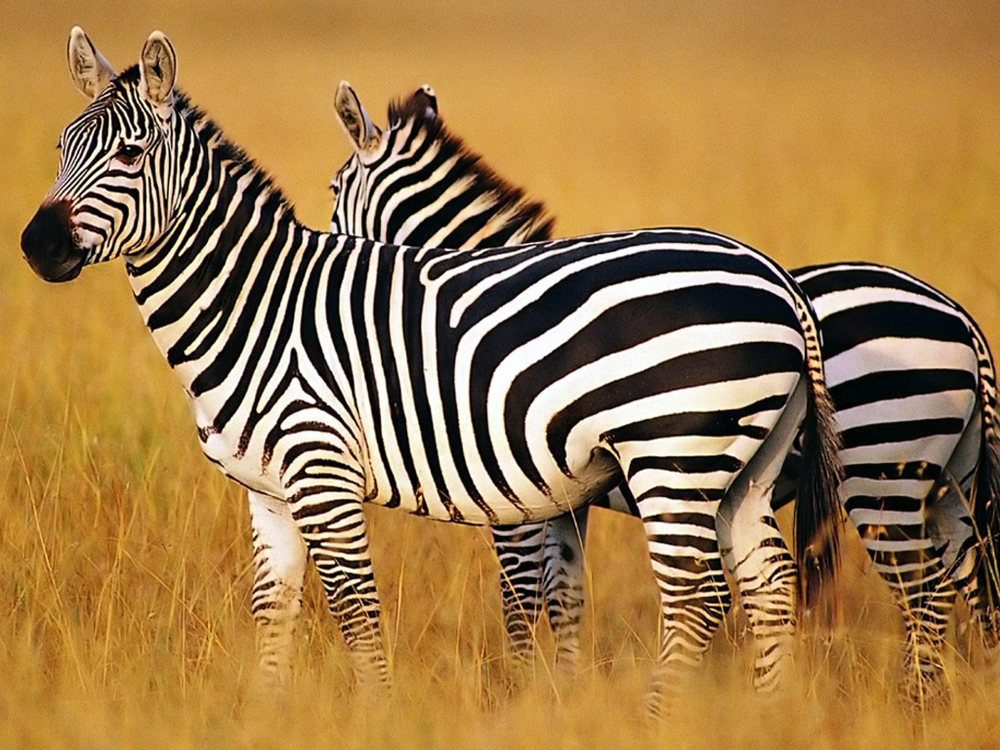
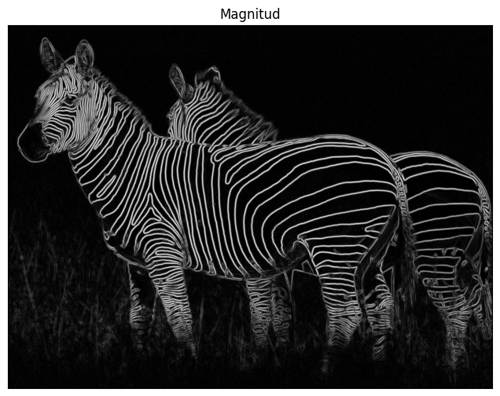
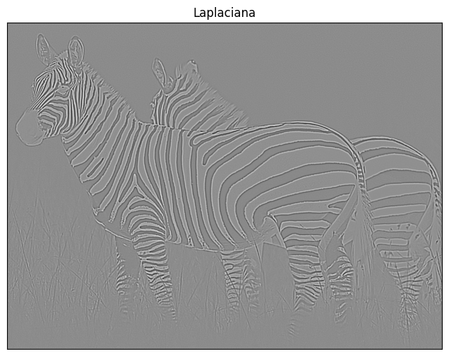
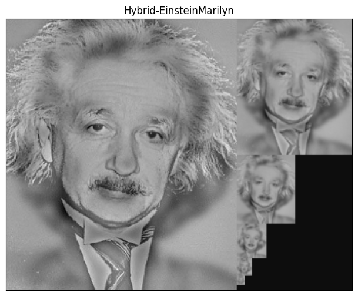
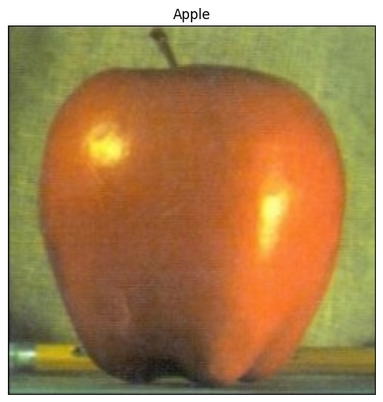
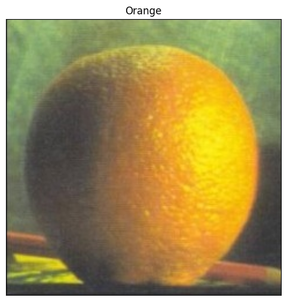
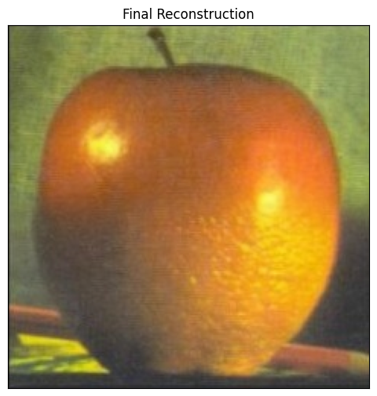

# Visión por computador

Prácticas de la asignatura Visión por Computador de la Escuela Técnica Superior de Ingeniería Informática (ETSIIT), perteneciente al grado de Ingeniería Informática, curso 24/25.
 

## Importante
Para utilizar correctamente las imágenes ubicadas en la carpeta `images`, es fundamental asegurarse de que esta se encuentre en la siguiente ruta dentro de nuestro Google Drive: 

`/content/drive/My Drive/`

Esto garantizará que el acceso a los archivos sea correcto y sin errores durante la ejecución del código en Google Colab.

Además, debemos descargar el dataset indicado en `https://www.kaggle.com/competitions/spr-x-ray-age/data` y almacenarlo en nuestro `/content/drive/My Drive/Colab Notebooks` 

## Práctica 1: Procesamiento de Imágenes
La práctica se centra en implementar filtros de convolución para comprender cómo se aplican en imágenes, particularmente en el cálculo de las derivadas, lo que incluye trabajar con gradientes para detectar bordes y transiciones. También se busca utilizar técnicas de filtrado lineal para identificar patrones y elementos clave, demostrando cómo estas técnicas permiten interpretar la estructura y contenido visual de una imagen. Con un enfoque práctico en procesamiento de imágenes, se trabajan transformaciones matemáticas y análisis visual, incluyendo la implementación de filtros básicos como Sobel o Laplaciano para derivadas, la exploración de cómo estos resultados ayudan a identificar características importantes como bordes o texturas, y el uso de convoluciones como base para técnicas más avanzadas de visión por computador.

### Detectar bordes

### Imagen híbrida
 

### Unión de imágenes
  

---

## Práctica 2: Redes Neuronales Convolucionales y Explicabilidad
Esta práctica se enfoca en el desarrollo y mejora de modelos de redes neuronales convolucionales (CNN) para tareas de clasificación y regresión, utilizando el conjunto de datos CIFAR100 y el SPR X-Ray Age Prediction Challenge, junto a la biblioteca de **fastai** o **pythorch**. El objetivo principal es entrenar y optimizar redes profundas mediante técnicas como la creación de modelos desde cero y la mejora de arquitecturas preexistentes, experimentando con diferentes configuraciones de capas, funciones de activación y técnicas de regularización. También se trabaja con **transfer learning** y **fine-tuning** usando modelos preentrenados como **ResNet50**, adaptándolos para nuevas tareas de predicción. Finalmente, se incorpora el concepto de **IA explicable** al aplicar Grad-CAM para visualizar y comprender las decisiones tomadas por los modelos, ayudando a interpretar qué áreas de una imagen influyen en las predicciones, lo cual es esencial para mejorar la transparencia y confiabilidad de los modelos de visión por computadora.